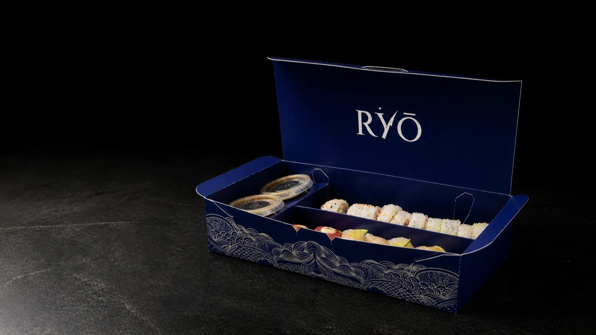

# RYŌ Unboxed

Landing editorial y audiovisual para RYŌ Sushi. La experiencia convierte la caja azul en un recorrido ligado al scroll: entrada, giro, apertura, anatomía de cuatro rolls, retorno, cierre y contacto.

[Ver la landing](https://vsu25.github.io/RYO_landing/) · [WhatsApp](https://wa.me/584220382261) · [Instagram](https://www.instagram.com/ryomcbo/)



## Experiencia pública

- Tres videos propios sincronizados con el progreso, sin reproducción automática lineal.
- Anatomía en orden `Playboy → Yuzu → Koga → Sei`, con coordenadas e ingredientes propios por roll.
- Stinger de dos puertas con patrón y wordmark RYŌ.
- Layout responsive y alternativa completa para `prefers-reduced-motion`.
- Cierre editorial con WhatsApp e Instagram verificados.

El menú `Explorar / Lista` existe como prototipo local. No forma parte del artifact público hasta aprobar sus imágenes, vigencia y permiso de publicación.

## Tecnología

- Next.js 16 con App Router y exportación estática.
- React 19 y TypeScript estricto.
- GSAP, ScrollTrigger y `@gsap/react` para la única secuencia que requiere control temporal ligado al scroll.
- CSS propio; sin backend, CMS, base de datos, cookies ni servicios recurrentes.
- GitHub Actions y GitHub Pages, con `basePath` configurado durante el build.

## Desarrollo local

Requiere Node.js 20.9 o posterior.

```bash
npm ci
npm run dev
```

Abre `http://127.0.0.1:3000/`. El comando prepara también `http://127.0.0.1:3000/menu/` usando masters que permanecen fuera de Git.

Comandos útiles:

```bash
npm run typecheck  # TypeScript
npm run build      # exporta la landing pública en out/
npm test           # contenido, allowlist y exclusión del menú
npm run check      # validación completa
npm run preview    # sirve out/ en el puerto 4173
```

## Arquitectura

| Ruta | Responsabilidad |
|---|---|
| `src/app/` | Layout, metadata y landing prerenderizada. |
| `src/components/landing/` | Stinger, historia scroll-reactive y anatomía. |
| `src/components/menu/` | Menú React disponible únicamente en desarrollo local. |
| `src/data/menu.json` | Fuente única de los diez platos y cuatro anatomías. |
| `public/media/` | Allowlist de los doce assets autorizados para la landing. |
| `scripts/local-menu-media.mjs` | Prepara y retira la ruta/media local del menú. |
| `deliverables/design/` | Dirección visual y prototipos HTML revisables. |
| `planning-docs/` | Producto, contenido, técnica y roadmap. |
| `reports/` | Evidencia de QA fechada. |

El estado operativo vive en [PROJECT.md](PROJECT.md); las decisiones técnicas, en [planning-docs/technical-spec.md](planning-docs/technical-spec.md).

## Publicación

Cada push a `main` ejecuta `npm ci`, `npm run check` y publica `out/` en GitHub Pages. El build elimina antes la ruta local `/menu` y sus seis imágenes pendientes; las pruebas fallan si alguna llega al artifact.

## Marca y contenido

El código y la documentación no conceden derechos de reutilización sobre el nombre RYŌ, el logotipo, las fotografías, el menú ni los assets de marca. Las fuentes, permisos y límites se registran en [planning-docs/content-and-source-inventory.md](planning-docs/content-and-source-inventory.md).
